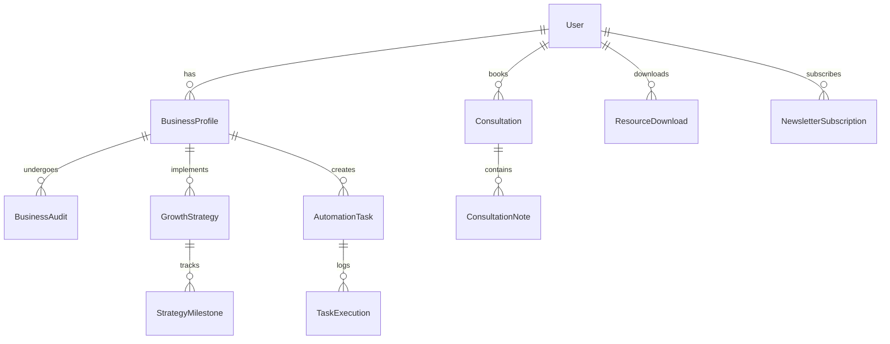

# Business of One - Database Schema

## Overview
This document outlines the database schema for the Business of One platform, designed to support solo entrepreneurs with business optimization, growth strategy, and automation tools.

## Entity Relationship Diagram



## Tables

### 1. users
Primary user account information.

| Column | Type | Constraints | Description |
|--------|------|-------------|-------------|
| id | UUID | PRIMARY KEY | Unique identifier |
| email | VARCHAR(255) | UNIQUE, NOT NULL | User's email address |
| password_hash | VARCHAR(255) | NOT NULL | Hashed password |
| first_name | VARCHAR(100) | NOT NULL | User's first name |
| last_name | VARCHAR(100) | NOT NULL | User's last name |
| phone | VARCHAR(20) | | Phone number |
| timezone | VARCHAR(50) | DEFAULT 'UTC' | User's timezone |
| is_active | BOOLEAN | DEFAULT true | Account status |
| email_verified | BOOLEAN | DEFAULT false | Email verification status |
| created_at | TIMESTAMP | DEFAULT NOW() | Account creation timestamp |
| updated_at | TIMESTAMP | DEFAULT NOW() | Last update timestamp |

### 2. business_profiles
Business information for each user.

| Column | Type | Constraints | Description |
|--------|------|-------------|-------------|
| id | UUID | PRIMARY KEY | Unique identifier |
| user_id | UUID | FOREIGN KEY | Reference to users table |
| business_name | VARCHAR(255) | NOT NULL | Name of the business |
| industry | VARCHAR(100) | | Business industry |
| business_stage | ENUM | | 'idea', 'startup', 'growing', 'established' |
| annual_revenue | DECIMAL(12,2) | | Current annual revenue |
| target_revenue | DECIMAL(12,2) | | Target annual revenue |
| business_model | TEXT | | Description of business model |
| main_challenges | JSONB | | Array of main business challenges |
| created_at | TIMESTAMP | DEFAULT NOW() | Profile creation timestamp |
| updated_at | TIMESTAMP | DEFAULT NOW() | Last update timestamp |

### 3. consultations
Scheduled consultation sessions.

| Column | Type | Constraints | Description |
|--------|------|-------------|-------------|
| id | UUID | PRIMARY KEY | Unique identifier |
| user_id | UUID | FOREIGN KEY | Reference to users table |
| scheduled_at | TIMESTAMP | NOT NULL | Consultation date and time |
| duration_minutes | INTEGER | DEFAULT 60 | Duration in minutes |
| type | ENUM | | 'strategy', 'audit', 'follow_up' |
| status | ENUM | | 'scheduled', 'completed', 'cancelled' |
| meeting_link | VARCHAR(500) | | Video conferencing link |
| cancelled_at | TIMESTAMP | | Cancellation timestamp |
| completed_at | TIMESTAMP | | Completion timestamp |
| created_at | TIMESTAMP | DEFAULT NOW() | Booking timestamp |

### 4. consultation_notes
Notes and outcomes from consultations.

| Column | Type | Constraints | Description |
|--------|------|-------------|-------------|
| id | UUID | PRIMARY KEY | Unique identifier |
| consultation_id | UUID | FOREIGN KEY | Reference to consultations |
| summary | TEXT | | Session summary |
| key_insights | JSONB | | Array of key insights |
| action_items | JSONB | | Array of action items |
| follow_up_required | BOOLEAN | DEFAULT false | Follow-up needed |
| internal_notes | TEXT | | Private consultant notes |
| created_at | TIMESTAMP | DEFAULT NOW() | Note creation timestamp |
| updated_at | TIMESTAMP | DEFAULT NOW() | Last update timestamp |

### 5. business_audits
Business audit assessments.

| Column | Type | Constraints | Description |
|--------|------|-------------|-------------|
| id | UUID | PRIMARY KEY | Unique identifier |
| business_profile_id | UUID | FOREIGN KEY | Reference to business_profiles |
| audit_date | DATE | NOT NULL | Date of audit |
| overall_score | DECIMAL(3,2) | | Score 0-10 |
| operations_score | DECIMAL(3,2) | | Operations assessment |
| marketing_score | DECIMAL(3,2) | | Marketing assessment |
| finance_score | DECIMAL(3,2) | | Finance assessment |
| technology_score | DECIMAL(3,2) | | Technology assessment |
| recommendations | JSONB | | Detailed recommendations |
| created_at | TIMESTAMP | DEFAULT NOW() | Audit creation timestamp |

### 6. growth_strategies
Growth strategy plans.

| Column | Type | Constraints | Description |
|--------|------|-------------|-------------|
| id | UUID | PRIMARY KEY | Unique identifier |
| business_profile_id | UUID | FOREIGN KEY | Reference to business_profiles |
| strategy_name | VARCHAR(255) | NOT NULL | Strategy title |
| description | TEXT | | Detailed description |
| target_timeline | INTERVAL | | Expected timeline |
| priority | ENUM | | 'low', 'medium', 'high' |
| status | ENUM | | 'draft', 'active', 'completed', 'paused' |
| expected_impact | TEXT | | Expected business impact |
| resources_required | JSONB | | Required resources |
| created_at | TIMESTAMP | DEFAULT NOW() | Strategy creation timestamp |
| updated_at | TIMESTAMP | DEFAULT NOW() | Last update timestamp |

### 7. strategy_milestones
Milestones for tracking strategy progress.

| Column | Type | Constraints | Description |
|--------|------|-------------|-------------|
| id | UUID | PRIMARY KEY | Unique identifier |
| growth_strategy_id | UUID | FOREIGN KEY | Reference to growth_strategies |
| milestone_name | VARCHAR(255) | NOT NULL | Milestone title |
| description | TEXT | | Milestone description |
| target_date | DATE | | Target completion date |
| completed_date | DATE | | Actual completion date |
| status | ENUM | | 'pending', 'in_progress', 'completed' |
| created_at | TIMESTAMP | DEFAULT NOW() | Milestone creation timestamp |

### 8. automation_tasks
Automation configurations and workflows.

| Column | Type | Constraints | Description |
|--------|------|-------------|-------------|
| id | UUID | PRIMARY KEY | Unique identifier |
| business_profile_id | UUID | FOREIGN KEY | Reference to business_profiles |
| task_name | VARCHAR(255) | NOT NULL | Task name |
| task_type | VARCHAR(100) | | Type of automation |
| description | TEXT | | Task description |
| trigger_config | JSONB | | Trigger configuration |
| action_config | JSONB | | Action configuration |
| is_active | BOOLEAN | DEFAULT true | Task status |
| last_run_at | TIMESTAMP | | Last execution timestamp |
| next_run_at | TIMESTAMP | | Next scheduled run |
| created_at | TIMESTAMP | DEFAULT NOW() | Task creation timestamp |
| updated_at | TIMESTAMP | DEFAULT NOW() | Last update timestamp |

### 9. task_executions
Log of automation task executions.

| Column | Type | Constraints | Description |
|--------|------|-------------|-------------|
| id | UUID | PRIMARY KEY | Unique identifier |
| automation_task_id | UUID | FOREIGN KEY | Reference to automation_tasks |
| started_at | TIMESTAMP | NOT NULL | Execution start time |
| completed_at | TIMESTAMP | | Execution end time |
| status | ENUM | | 'running', 'success', 'failed' |
| error_message | TEXT | | Error details if failed |
| execution_log | JSONB | | Detailed execution log |
| created_at | TIMESTAMP | DEFAULT NOW() | Log creation timestamp |

### 10. resource_downloads
Track resource downloads.

| Column | Type | Constraints | Description |
|--------|------|-------------|-------------|
| id | UUID | PRIMARY KEY | Unique identifier |
| user_id | UUID | FOREIGN KEY | Reference to users table |
| resource_name | VARCHAR(255) | NOT NULL | Resource title |
| resource_type | VARCHAR(50) | | 'guide', 'template', 'checklist' |
| file_path | VARCHAR(500) | | Storage path |
| downloaded_at | TIMESTAMP | DEFAULT NOW() | Download timestamp |

### 11. newsletter_subscriptions
Newsletter subscription management.

| Column | Type | Constraints | Description |
|--------|------|-------------|-------------|
| id | UUID | PRIMARY KEY | Unique identifier |
| user_id | UUID | FOREIGN KEY | Reference to users table |
| email | VARCHAR(255) | NOT NULL | Subscription email |
| frequency | ENUM | DEFAULT 'weekly' | 'daily', 'weekly', 'monthly' |
| topics | JSONB | | Array of subscribed topics |
| is_active | BOOLEAN | DEFAULT true | Subscription status |
| unsubscribed_at | TIMESTAMP | | Unsubscribe timestamp |
| created_at | TIMESTAMP | DEFAULT NOW() | Subscription timestamp |

## Indexes

```sql
-- Performance indexes
CREATE INDEX idx_consultations_user_scheduled ON consultations(user_id, scheduled_at);
CREATE INDEX idx_consultations_status ON consultations(status);
CREATE INDEX idx_business_audits_profile ON business_audits(business_profile_id, audit_date);
CREATE INDEX idx_growth_strategies_profile_status ON growth_strategies(business_profile_id, status);
CREATE INDEX idx_automation_tasks_profile_active ON automation_tasks(business_profile_id, is_active);
CREATE INDEX idx_task_executions_task_status ON task_executions(automation_task_id, status);

-- Full-text search indexes
CREATE INDEX idx_business_profiles_search ON business_profiles USING gin(to_tsvector('english', business_name || ' ' || COALESCE(industry, '')));
CREATE INDEX idx_growth_strategies_search ON growth_strategies USING gin(to_tsvector('english', strategy_name || ' ' || COALESCE(description, '')));
```

## Security Considerations

1. **Row-Level Security (RLS)**: Enable RLS on all tables to ensure users can only access their own data.
2. **Encryption**: Sensitive data should be encrypted at rest.
3. **Audit Trail**: Consider adding audit tables to track all data modifications.
4. **PII Protection**: Implement data retention policies for personally identifiable information.

## Migration Strategy

1. Create migrations in sequential order to maintain referential integrity.
2. Use database transactions for all schema changes.
3. Implement rollback procedures for each migration.
4. Test migrations in a staging environment before production deployment.